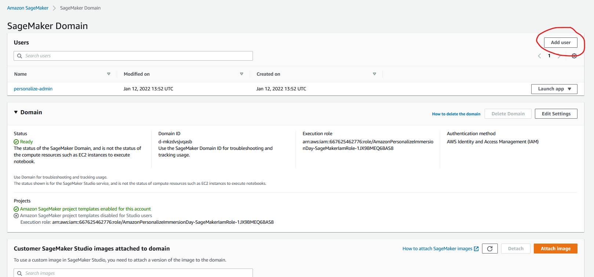
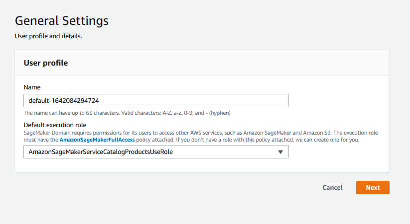
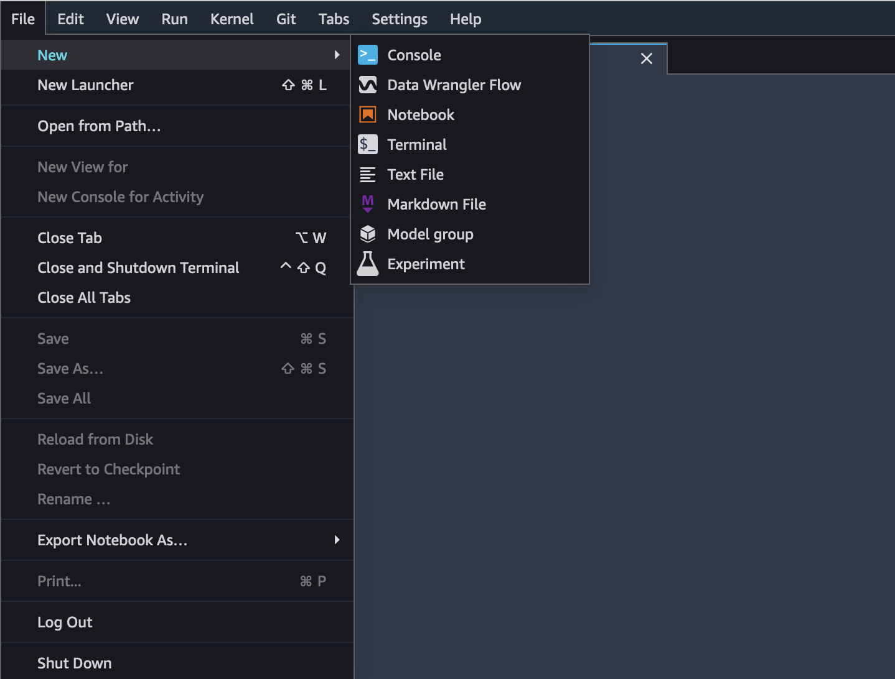
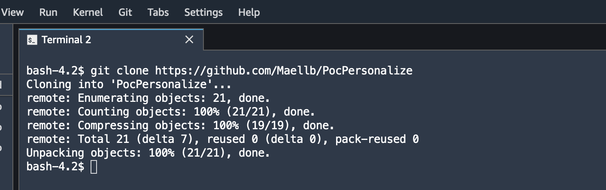
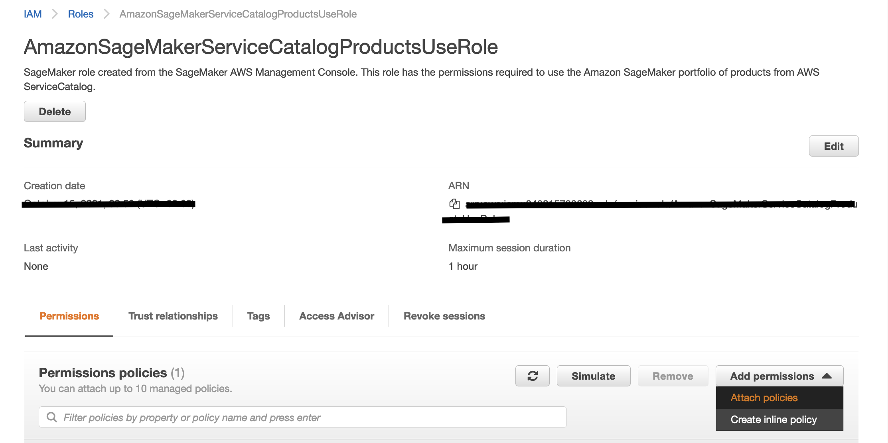
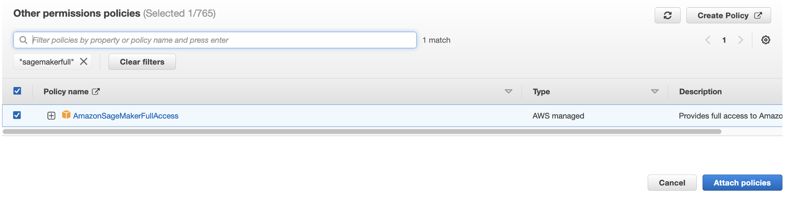

# PocPersonalize
Jupyter notebooks that will help you onboard with AWS personalize various features and understand how personalization works.

## 📋 Table of content

 - [Installation](#-install)
 - [Permissions](#-IAM-permissions)
 - [Metrics](#-metrics)
 - [Pre-requisites](#-pre-requisites)
 - [Description](#-description)
 - [Usage](#-usage)
 - [See also](#-see-also)

## 🚀 Install

1. Create a user in SageMaker studio.

2. Launch SageMaker Studio

3. Open a terminal and clone this repo into SageMaker

## IAM-permissions

Your SageMaker user will need to have SageMaker and Personalize Full Access.

1. Navigate to the IAM Console and select "Roles"
2. Find the SageMaker user you created, it should start like this "AmazonSageMakerServiceCatalogProductsUseRole". 
3. Click "Attach Policies"

5. Select the "AmazonSageMakerFullAccess" and click "Attach Policy"

7. Do the same for "AmazonPersonalizeFullAccess" and "IAMFullAccess"

## 📊 Metrics

The below metrics displays approximate values associated with deploying and using this block.

Metric | Value
------ | ------
**Type** | Demonstration
**Installation Time** | 15 minutes
**Audience** | Developers, Solutions Architects DevOps, 

## 🎒 Pre-requisites

List here your project pre-requisites

- Python 3.8.5
- AWS SageMaker and Personalize Access

## 🔰 Description

In this project you will be able to find Jupyter notebooks to test Amazon Personalize various features, call the API to get recommendations for different users.

Notebooks description :

- Dataset

    This notebook contains instructions on how to import and clean up the dataset, creating a S3 bucket, with the required IAM roles, uploading     your data to S3, and importing the data into Amazon Personalize.

- Training 

    Once you have finished Preparing and Importing Data, you are ready to create a Solution. 

    In this chapter you will be interacting with the Training Layer notebook. 
    A Solution refers to the combination of an Amazon Personalize recipe, customized parameters, and one or more solution versions (trained models). Once you create a solution with a solution version, you can create a campaign to deploy the solution version and get recommendations.

- RANK

    This notebook provides you with function to call the GetPersonalizedRanking API. 

    The Personalized-Ranking recipe generates personalized rankings of items. A personalized ranking is a list of recommended items that are re-ranked for a specific user. This is useful if you have a collection of ordered items, such as search results, promotions, or curated lists, and you want to provide a personalized re-ranking for each of your users. 

- SIMS

    This notebook provides you with function to call the GetRecommendations API and try the SIMS recipe. 

    The Item-to-item similarities (SIMS) recipe uses collaborative filtering to recommend items that are most similar to an item you specify when you get recommendations. SIMS uses your Interactions dataset, not item metadata such as color or price, to determine similarity. SIMS identifies the co-occurrence of the item in user histories in your Interaction dataset to recommend similar items. For example, with SIMS Amazon Personalize could recommend coffee shop items customers frequently bought together or movies that different users also watched. 

- USER

    This notebook provides you with function to call the GetRecommendations API and try the User Personalization recipe. 

    The User-Personalization (aws-user-personalization) recipe is optimized for all personalized recommendation scenarios. It predicts the items that a user will interact with based on Interactions, Items, and Users datasets. When recommending items, it uses automatic item exploration.

- Visualization

    Bonus notebook to benchmark personalization recommendations.

## 🛠 Usage

After doing the installation part, you can simply run the code in the notebook starting with the dataset one then the training notebook.

Afterwards, you are free to try any recommendations API described above.

## 👀 See also

 * `Personalize workshop` https://catalog.us-east-1.prod.workshops.aws/v2/workshops/c5a0c80f-1a42-442c-b2c0-956b38d4dc48/en-US/getting-started
 * `Personalize official documentation` https://aws.amazon.com/fr/personalize/

Enjoy!
